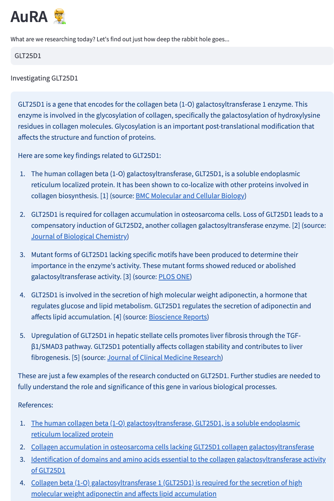
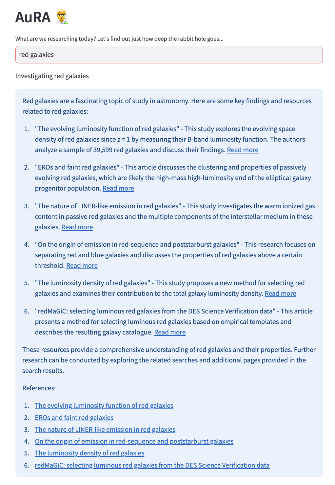

# AuRA
An AUtonomous Research Assistant, scouring relevant papers on google scholar so that you don't have to. 

---

## Hi, I'm Aura! 🧑‍🔬 Your very own Autonomous Research Assistant 🔥
### AutoGPT applied to Research
Welcome to Aura, your dedicated research companion. I'm here to empower researchers at all levels and assist you in staying at the forefront of cutting-edge research in any domain. I'll sift through Google Scholar to uncover recent, pertinent papers on your chosen topic and offer concise summaries. If you're eager for more, I'll equip you with a trove of reference links for deeper exploration.

Getting Started is a Breeze
- Define Your Research Goal: Enter your research query in the textbox below. Whether it's a broad inquiry like 'What is ALS?' or a focused question about 'GLT25D1's role in human collagen production,' I'm here to help.
- Adjust the Timeframe: Utilize the year slider to determine the research timeframe. Slide left to include more recent findings or leave it at 0 to encompass all years.
- Navigate to AuRA: Open the dropdown menu on the left and select the 'AuRA' tab to embark on your research journey.

Weekly Reports (Coming Soon...)
- Enter your email and I'll send you weekly summaries on your desired research interest.

Here's what type of results to be expected:

    
    

---

We have a simple UI to but achieve a complex task under the hood. Enter any scientifically oriented topic and we'll scour through Google Scholar for the most relevant papers for you. Citing sources is essential for true scientific rigour, and that's exactly what AuRA will provide to you. Future iterations will be able to email you with weekly reports of your research topic of choice, so that you can stay as up to date as possible on what matters most to you. 
