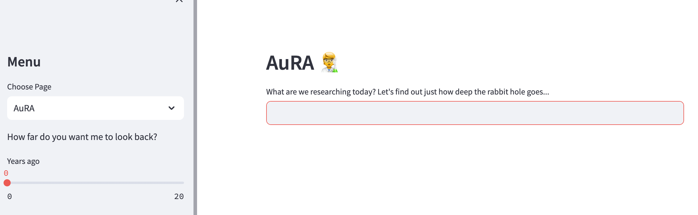

# AuRA
An AUtonomous Research Assistant, scouring relevant papers on google scholar so that you don't have to. 

---

Welcome to Aura, your dedicated research companion. I'm here to empower researchers at all levels and assist you in staying at the forefront of cutting-edge research in any domain. I'll sift through Google Scholar to uncover recent, pertinent papers on your chosen topic and offer concise summaries. If you're eager for more, I'll equip you with a trove of reference links for deeper exploration.

We have a simple UI to but achieve a complex task under the hood. Enter any scientifically oriented topic and we'll scour through Google Scholar for the most relevant papers for you. Citing sources is essential for true scientific rigour, and that's exactly what AuRA will provide to you. Future iterations will be able to email you with weekly reports of your research topic of choice, so you can stay as up to date as possible on what matters most to you. 
